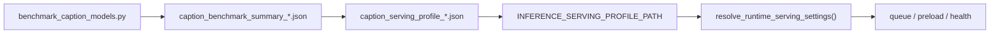

# Caption Model Benchmarking Guide

## 목적

이미지 캡셔닝 후보 모델을 같은 조건에서 비교해, 다음 항목을 근거로 서빙 대상을 결정합니다.

- 추론 시간: NFR 기준인 `10초 이내` 만족 여부
- VRAM 사용량: RTX 4070에서 안정적으로 구동 가능한지
- 캡션 품질: 물체, 장면, 위치 단서가 얼마나 잘 드러나는지
- 운영성: 서버 시작 시 1회 로드, Celery 워커 재사용 구조에 적합한지

## 현재 구현 상태 해석

현재 저장소 기준(842f923433e2deb02c8936012ec12837b8603adb)으로는 아래까지는 이미 연결되어 있습니다.

- 업로드 이미지를 S3에 저장
- Celery 워커가 비동기 task 처리
- 워커가 S3에서 이미지를 읽어 BLIP 캡션 생성

즉, 인프라/비동기 파이프라인의 초안은 잡혀 있고, 다음 우선순위는 아래 2개가 맞습니다.

- 캡셔닝 모델 후보군 비교 및 서빙 모델 선정
- 전처리, 객체 인식, 공간 추론을 캡셔닝 파이프라인 옆으로 확장

## 추천 비교 대상

첫 라운드는 아래처럼 나누는 것이 현실적입니다.

- `blip-base`: 빠른 기준선
- `git-base`: 경량 대안
- `vit-gpt2`: 가장 단순한 대조군
- `blip-large`: 품질 상향 비교군
- `blip2-opt-2.7b`: 양자화 전제로 정확도 상위 후보

RTX 4070 기준 추천 순서는 아래와 같습니다.

1. `blip-base`, `git-base`, `vit-gpt2`로 기본 속도/품질 범위 파악
2. `blip-large` 추가로 품질 상승폭 확인
3. `blip2-opt-2.7b`를 `8bit`, `4bit`로 비교

## 벤치마킹 데이터셋 구성

모델 선정용 데이터셋은 실제 사용 시나리오를 반영해야 합니다.

- 자주 찾는 물건: 열쇠, 지갑, 이어폰, 카드지갑, 가방, 안경
- 실내 맥락: 책상, 소파, 침대, 서랍, 선반, 식탁
- 난이도 조건:
  - 조명 밝음 / 어두움
  - 약간 흔들림 / 선명함
  - 유사 장면 반복
  - 부분 가림
  - 동일 물체가 다른 위치에 존재

권장 샘플 수:

- 1차 smoke test: 20~30장
- 1차 비교 실험: 100장 내외
- 최종 선정 실험: 300장 이상

## 평가 기준

정량 항목:

- `load_time_sec`: 서버 시작 시 모델 로드 시간
- `latency_avg_sec`, `latency_p50_sec`, `latency_p95_sec`
- `peak_memory_mb`
- `images_error`
- `lexical_f1_avg`: 참조 캡션이 있을 때만 계산되는 간단 비교 지표

정성 항목:

- 핵심 물체를 놓치지 않는가
- 위치 단서(`on desk`, `next to keyboard`, `under chair`)를 잘 설명하는가
- 너무 일반적인 문장만 생성하지 않는가
- 같은 장면에서 캡션 일관성이 유지되는가

## 실행 방법

### 1. 의존성 설치

`apps/inference-server/requirements.txt` 기준으로 설치합니다.

양자화 실험까지 할 경우 `bitsandbytes`가 추가로 필요할 수 있습니다.

### 2. 데이터셋 준비

예시:

```text
apps/inference-server/sample_data/
├─ frame_001.jpg
├─ frame_002.jpg
└─ ...
```

선택적으로 참조 캡션 파일을 준비합니다.

```csv
image_path,reference_caption
apps/inference-server/sample_data/frame_001.jpg,a black backpack is on a wooden chair
apps/inference-server/sample_data/frame_002.jpg,a pair of keys is next to a monitor on a desk
```

### 3. 기본 벤치마크

```bash
cd /home/ghpark/projects/smart-glass-project
PYTHONPATH=apps/inference-server python3 apps/inference-server/scripts/benchmark_caption_models.py \
  --dataset-dir apps/inference-server/sample_data \
  --models blip-base git-base vit-gpt2 \
  --quantizations none \
  --output-dir apps/inference-server/benchmark_results
```

### 4. 양자화 비교

```bash
cd /home/ghpark/projects/smart-glass-project
PYTHONPATH=apps/inference-server python3 apps/inference-server/scripts/benchmark_caption_models.py \
  --dataset-dir apps/inference-server/sample_data \
  --models blip2-opt-2.7b \
  --quantizations 8bit 4bit \
  --dtype float16 \
  --max-images 30
```

선택적으로 latency budget을 명시할 수 있습니다.

```bash
cd /home/ghpark/projects/smart-glass-project
PYTHONPATH=apps/inference-server python3 apps/inference-server/scripts/benchmark_caption_models.py \
  --dataset-dir apps/inference-server/sample_data \
  --models blip-base git-base vit-gpt2 \
  --quantizations none \
  --latency-budget-sec 10 \
  --output-dir apps/inference-server/benchmark_results
```

## Serving Profile Artifact

벤치마크가 끝나면 summary JSON뿐 아니라 서빙 결정용 profile도 함께 생성합니다.

- timestamped artifact: `caption_serving_profile_<timestamp>.json`
- stable artifact: `caption_serving_profile.json`

이 profile은 “실험 결과”와 “runtime 기본값” 사이를 잇는 machine-readable 산출물입니다.



profile 기본 선택 규칙은 아래 순서를 따릅니다.

1. `images_success > 0`
2. `images_error == 0`
3. `latency_p95_sec`가 존재
4. latency budget 이내 후보 우선
5. `lexical_f1_avg`가 있으면 높은 후보 우선
6. 그 다음 `latency_p95_sec`, `peak_memory_max_mb`, `load_time_sec` 순으로 비교

runtime 해석 우선순위는 다음과 같습니다.

1. 명시적 `VISION_CAPTION_*` env
2. `INFERENCE_SERVING_PROFILE_PATH`가 가리키는 profile 기본값
3. 기존 legacy 기본값 (`blip-base`, `none`, `float16`)

runtime / preload / health는 이제 이 선택 결과를 공통 `executionPolicy` 언어로 드러냅니다.

- `settingsSource`
- `profilePath`
- `selectedModelKey`
- `softTimeLimitSec`
- `hardTimeLimitSec`
- `fallbackModelKey`
- `fallbackTriggered`

주의:

- 현재처럼 compose나 배포 환경에서 `VISION_CAPTION_*`를 이미 명시한 경우, serving profile은 관여하지 않습니다.
- 즉 이 artifact는 “env를 비운 환경에서 benchmark 결과를 기본값으로 재사용”하려는 경우에만 적용됩니다.

## 결과 해석 기준

운영 후보로 남길 기준 예시:

- `latency_p95_sec <= 10`
- `images_error == 0`
- VRAM 사용량이 운영 여유분을 남김
- 핵심 물체와 위치 단서가 정성 평가에서 충분히 드러남

추천 의사결정 방식:

1. 속도 탈락 모델 제거
2. VRAM 초과 또는 불안정 모델 제거
3. 남은 모델 중 캡션 품질 상위 모델 선택
4. 선택 결과를 serving profile로 저장
5. 최종 2개 모델만 실제 Celery 워커에 올려 A/B 테스트

## 코드 위치

- 모델 로더/추론 유틸: [apps/inference-server/src/models/captioning.py](/home/ghpark/projects/smart-glass-project/apps/inference-server/src/models/captioning.py)
- 벤치마크 실행 스크립트: [apps/inference-server/scripts/benchmark_caption_models.py](/home/ghpark/projects/smart-glass-project/apps/inference-server/scripts/benchmark_caption_models.py)
- 참조 캡션 샘플: [apps/inference-server/benchmarks/caption_references.sample.csv](/home/ghpark/projects/smart-glass-project/apps/inference-server/benchmarks/caption_references.sample.csv)

## 다음 단계

모델 선정이 끝나면 바로 아래 순서로 이어가면 됩니다.

1. 선택 모델을 Celery worker 초기화 단계에서 preload
2. 캡션 결과와 object detection 결과를 하나의 inference payload로 합치기
3. 흔들림 필터와 near-duplicate 제거를 업로드 직후 또는 워커 초입에 추가
4. 위치 추론 규칙(`on`, `under`, `next to`)을 구조화 필드로 저장
