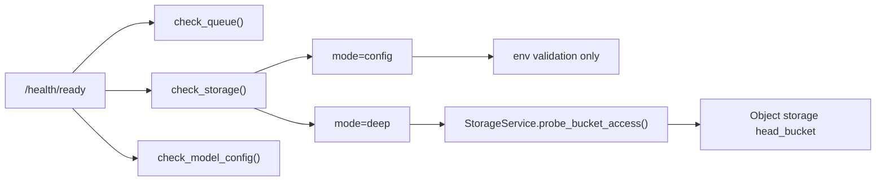

# Healthcheck Probes

`apps/inference-server` exposes two operational probe endpoints for `inference-api`, and the Celery worker uses an internal probe script.

- `GET /health/live`
  - Purpose: liveness probe
  - Meaning: the API process is up and able to respond
  - Use this when the platform supports a separate liveness probe

- `GET /health/ready`
  - Purpose: readiness probe
  - Meaning: the API process is up and key dependencies are ready
  - Current checks: Redis broker connectivity, storage readiness, caption model config
  - Returns `503` when the service is not ready to accept traffic

## Payload Shape

Health payloads keep the existing top-level fields:

- `status`: `ok` when every required check passes, otherwise `degraded`
- `service`: producing component such as `inference-server` or `inference-worker`
- `check_type`: `liveness` or `readiness`
- `timestamp`: UTC timestamp for when the probe was evaluated
- `checks`: per-component detail payloads

Readiness payloads also include:

- `ready`: boolean form of the readiness decision
- `summary.total`: number of checks evaluated
- `summary.passing`: number of checks with `status=ok`
- `summary.failing`: number of checks that are not `ok`
- `summary.failingChecks`: check names that are currently blocking readiness
- `summary.statuses`: compact check-name to status map

`GET /health/live` also includes `summary` for consistency, but does not use
`ready` because it only answers whether the API process can respond.

## Storage Readiness Modes

Storage readiness is controlled by `INFERENCE_STORAGE_READINESS_MODE`.

- `config` (default)
  - validates required storage env vars
  - skips a real object storage bucket probe
  - keeps readiness checks fast and predictable for local and CI environments

- `deep`
  - validates required storage env vars
  - performs a real `head_bucket` probe through `StorageService`
  - surfaces bucket access or network problems directly in readiness

The readiness payload includes the selected `mode` and nested `probe` detail so operators can tell whether the response reflects configuration-only validation or actual storage access verification.

## Docker Compose

Docker Compose supports a single container healthcheck, so `inference-api` uses the readiness endpoint and `inference-worker` uses a Celery ping-based script.

```yaml
inference-worker:
  healthcheck:
    test:
      [
        "CMD",
        "python",
        "/app/scripts/worker_healthcheck.py"
      ]
    interval: 30s
    timeout: 10s
    retries: 3
    start_period: 30s

inference-api:
  healthcheck:
    test:
      [
        "CMD",
        "python",
        "/app/scripts/http_healthcheck.py",
        "http://127.0.0.1:8000/health/ready"
      ]
    interval: 30s
    timeout: 5s
    retries: 3
    start_period: 20s
```

`worker_healthcheck.py` verifies:

- the Celery worker responds to `ping`
- Redis broker connectivity is available
- storage readiness passes in the configured mode (`config` or `deep`)
- configured model key / quantization / dtype are valid
- worker startup preload finished successfully and wrote a ready status file
- resolved execution policy is visible through the same `settingsSource / profilePath / selectedModelKey / time limits / fallback` vocabulary used by runtime results



## Worker Preload

`inference-worker` can preload the serving model during container startup.

- enabled with `INFERENCE_WORKER_PRELOAD_ON_STARTUP=1`
- preload status file path defaults to `/tmp/inference-worker-preload.json`
- when `INFERENCE_PRELOAD_FAIL_FAST=1`, preload failure stops worker startup
- preload target defaults to `VISION_CAPTION_MODEL` and can be overridden with `VISION_PRELOAD_MODEL`
- preload status payload also includes `executionPolicy` so startup selection can be compared against runtime result metadata

This is a startup-time behavior, not an image build-time behavior. Docker image build only installs code and dependencies; the model is downloaded and loaded when the worker container actually starts.

## Deployment Example

When deploying to Kubernetes or another orchestrator that supports separate probes, wire them like this.

```yaml
livenessProbe:
  httpGet:
    path: /health/live
    port: 8000
  initialDelaySeconds: 10
  periodSeconds: 30

readinessProbe:
  httpGet:
    path: /health/ready
    port: 8000
  initialDelaySeconds: 5
  periodSeconds: 15
```
